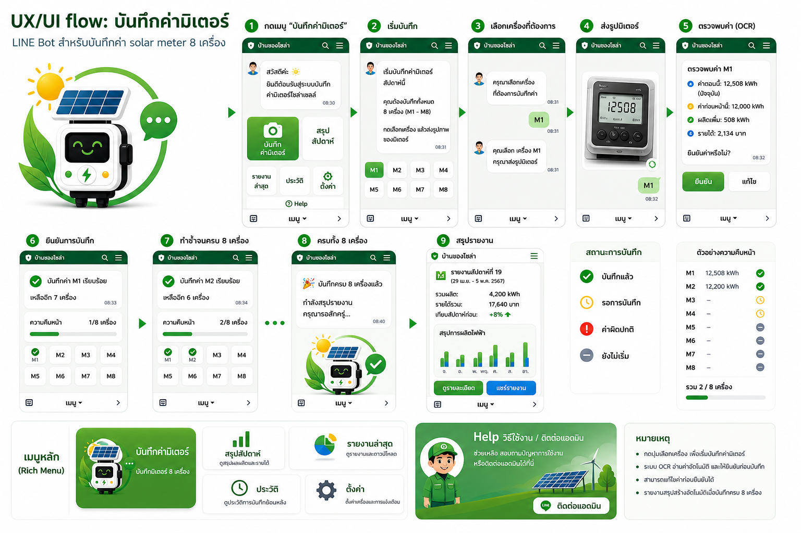

# Solar Meter LINE Bot Documentation



เอกสารชุดนี้เป็น technical spec สำหรับระบบ:

```text
LINE -> Python Backend -> Google Vision OCR -> SQLite -> Report image -> LINE
                                                └-> optional Google Sheets export
```

## Current Status

- Production OCR path: Google Vision `DOCUMENT_TEXT_DETECTION`
- Primary storage path: SQLite (`STORAGE_BACKEND=sqlite`)
- Legacy/export storage path: Google Sheets (`STORAGE_BACKEND=sheets`)
- Optional business mirror: Google Sheets auto sync (`SHEETS_SYNC_ENABLED=true`)
- Credential: ใช้ service account เดียวกับ Google Sheets ผ่าน `GOOGLE_APPLICATION_CREDENTIALS`
- Real-image fixture: `tmp/test-ocr`
- Latest OCR target: `8/8`
- Latest Google Vision report: `reports/ocr/ocr-evaluation-20260503-014420.md`

หมายเหตุ: ค่า OCR ยังต้องผ่าน confirmation ก่อนบันทึกเสมอ โดยเฉพาะ low-confidence case เช่นทศนิยมท้ายของมิเตอร์ `ENTES MPR-45S`

## Documents

- [Ordered Implementation Tasks](docs/11-ordered-implementation-tasks.md)
- [Project Overview](docs/00-overview.md)
- [System Architecture](docs/01-architecture.md)
- [Google Sheets Schema](docs/02-google-sheets-schema.md)
- [Backend API Spec](docs/03-backend-api.md)
- [OCR Model: Google Vision](docs/04-ocr-google-vision.md)
- [LINE Bot Conversation Flow](docs/05-line-bot-flow.md)
- [Environment and Deployment](docs/06-env-and-deployment.md)
- [Release and Packaging](docs/10-release-and-packaging.md)
- [MVP Roadmap](docs/07-roadmap.md)
- [Version 2.0 LINE UX Design](docs/08-v2-line-ux-design.md)
- [History and Settings LINE UX Design](docs/09-history-settings-ux-design.md)
- [v0.3.0 SQLite Performance Upgrade](docs/v0.3.0-sqlite-performance/README.md)

## Recommended MVP

เริ่มจาก flow ที่ให้คนยืนยันก่อนบันทึก:

1. ผู้ใช้พิมพ์ `M1`
2. ผู้ใช้ส่งรูปมิเตอร์
3. Backend ดาวน์โหลดรูปจาก LINE
4. Google Vision OCR อ่านตัวเลข
5. Bot ตอบกลับให้ยืนยัน เช่น `อ่านได้ M1 = 12500 พิมพ์ OK หรือแก้เป็น M1 12508`
6. เมื่อยืนยันแล้ว append ลง Google Sheets
7. เมื่อครบ 8 เครื่องใน batch เดียวกัน สร้าง report image แล้วส่งกลับ LINE

## Local Verification

Run the full test suite:

```bash
rtk make test
```

Run Google Vision OCR evaluation against real test images:

```bash
rtk uv run python scripts/evaluate_ocr.py --engine google
```

Optional legacy comparison:

```bash
rtk uv run python scripts/evaluate_ocr.py --engine opentyphoon,google
```

## Required Google APIs

Enable these APIs in the Google Cloud project used by the service account:

- Google Sheets API
- Cloud Vision API

## Main External References

- LINE Messaging API: https://developers.line.biz/en/docs/messaging-api/
- Google Sheets API Python quickstart: https://developers.google.com/workspace/sheets/api/quickstart/python
- Google Cloud Vision OCR docs: https://cloud.google.com/vision/docs/ocr
