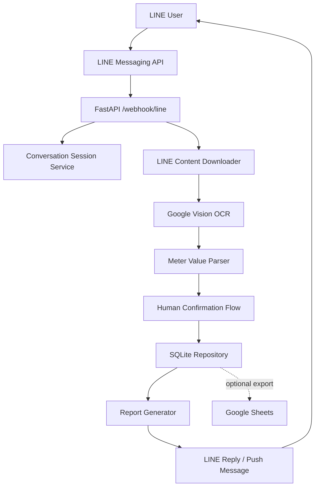
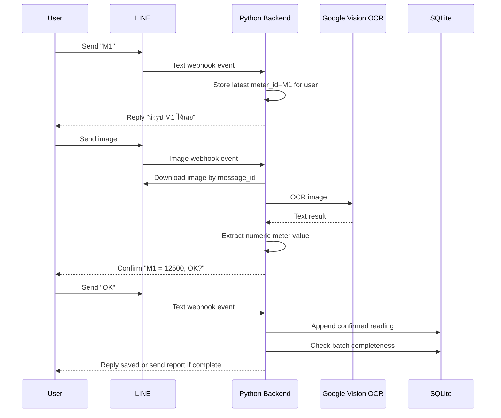

# System Architecture

## High-Level Architecture



## Recommended Backend Modules

```text
app/
  main.py
  config.py
  line/
    webhook.py
    client.py
    parser.py
  ocr/
    google_vision.py
    value_parser.py
  sheets/
    client.py
    repositories.py
  report/
    generator.py
    templates.py
  services/
    meter_service.py
    batch_service.py
    confirmation_service.py
  models/
    domain.py
    schemas.py
```

## Request Flow: Image Reading



## State Management

SQLite is the primary durable store for `v0.3.0` because this bot is optimized for a single operator or a small group. Google Sheets can still be used as a legacy/export target, but it should not sit in the critical webhook confirmation path.

When `SHEETS_SYNC_ENABLED=true`, the app pulls `meters` and `settings` from Google Sheets on startup, then periodically mirrors changed operational rows from SQLite back to Google Sheets.

Recommended MVP options:

- Simple local state: in-memory session dict, acceptable only for local demo
- Current `v0.3.0` storage: SQLite for meters, settings, batches, readings, pending confirmations, and audit rows
- Future scale-out option: Redis for short-lived conversation state plus Postgres or another server database if multiple app instances become necessary

## Batch Strategy

Use one weekly batch per LINE group or user.

Recommended `batch_id` format:

```text
{yyyy}-W{ww}-{line_source_id}
```

Example:

```text
2026-W19-Uxxxxxxxx
```

## Error Handling Strategy

- OCR timeout: tell user to retry image
- OCR unreadable: ask user to type value manually, e.g. `M1 12508`
- Unknown meter id: ask user to type meter id first
- Duplicate reading in same batch: ask whether to replace previous value
- SQLite write failure: keep pending confirmation and ask user to retry `OK`
- LINE reply failure: log event and use push message if possible

## Security Boundaries

- LINE webhook signature must be verified before processing
- Secrets must be stored in environment variables, not in source code
- Google service account JSON must not be committed
- Only allowed LINE users/groups should be able to write readings
- Dev-only endpoints must be disabled or protected in production
