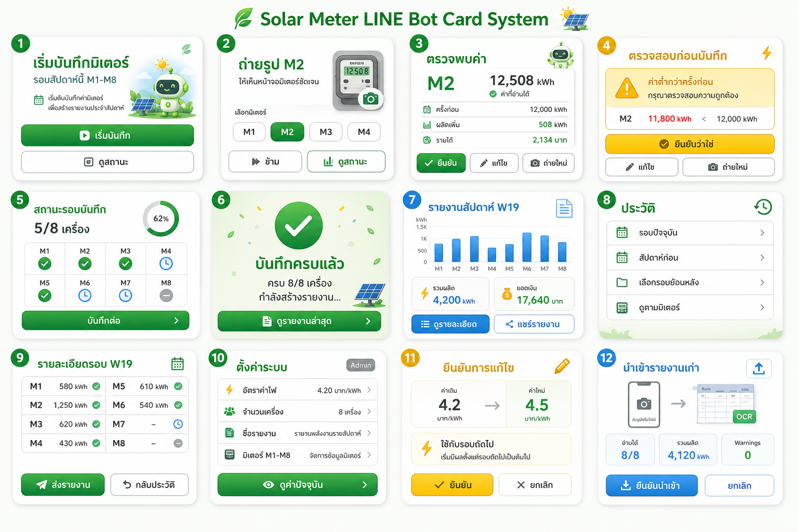

# v0.2.0 LINE Card Design Documentation

ชุดเอกสารนี้เป็น design and development handoff สำหรับยกระดับ LINE bot จาก text-first flow เป็น card-based UX ที่ใช้ Rich Menu, Flex Message, Quick Reply และ Postback action อย่างเป็นระบบ

ขอบเขตรอบนี้เป็นเอกสารและ visual reference เท่านั้น ยังไม่เปลี่ยน runtime code, public API, หรือ version ใน `pyproject.toml`

## Reference Concept

ภาพนี้เป็น direction board สำหรับ 12 card templates ใน theme Eco-Tech Clean Energy ใช้เป็น visual reference ไม่ใช่ final pixel-perfect implementation

## Document Map

| File | Purpose |
| --- | --- |
| `01-design-system.md` | กำหนด theme, color tokens, typography, layout, card anatomy, icon rules และ LINE readability rules |
| `02-card-template-spec.md` | ระบุ spec ของ 12 card templates พร้อม trigger, data fields, actions, postback mapping และ readiness |
| `03-interaction-flow-map.md` | map flow จาก Rich Menu ไปแต่ละ card, state transition, operator/admin split และ fallback text commands |
| `04-implementation-plan.md` | ลำดับพัฒนาจาก design ไป code, touchpoints, tests และ rollout checklist |
| `05-visual-alignment-plan.md` | แผนทำให้ LINE Flex cards จริงใกล้กับ mock reference พร้อม imagegen asset workflow และ graphify scope |
| `06-runtime-card-shell-plan.md` | แผนเก็บ runtime gaps 1-3: card behavior, shared Card Shell และ standard Flex builders |

## Design Goals

- ลดการพิมพ์คำสั่งเองให้เหลือน้อยที่สุด
- ทำให้ field operator รู้เสมอว่าต้องกดอะไรหรือส่งอะไรต่อ
- คง text commands เดิมเป็น fallback สำหรับสถานการณ์หน้างาน
- ใช้ card templates ซ้ำได้ ไม่สร้าง card เฉพาะกิจจนดูแลยาก
- ทำ visual language ให้ต่อเนื่องกับภาพ workflow ใน `docs/help-flows/`
- แยกสิทธิ์ operator/admin ใน card และ action ไม่แยก Rich Menu หลัก

## Success Criteria

- มี card templates ครบ 12 แบบสำหรับ flow หลักของ v0.2.0
- ทุก card มี use case, trigger, data fields, visual rules, primary/secondary actions และ fallback behavior
- Rich Menu ทั้ง 6 ปุ่ม map เข้ากับ flow และ card ชัดเจน
- Action ที่โค้ดรองรับไม่ครบถูก mark เป็น `Partial` หรือ `Future`
- เอกสารพร้อมให้ implement ต่อใน `app/line/messages.py`, `app/line/parser.py`, `app/line/webhook.py` และ tests ที่เกี่ยวข้อง

## Readiness Labels

| Label | Meaning |
| --- | --- |
| `Ready` | backend action หรือ behavior มีอยู่แล้ว และต้องออกแบบ/ปรับ presentation เป็นหลัก |
| `Partial` | มี action หรือ behavior บางส่วนแล้ว แต่ยังต้องเติม UI branch, card builder, หรือ edge case |
| `Future` | เป็น design intent ที่ยังไม่ควรสัญญากับผู้ใช้จนกว่าจะ implement เพิ่ม |

## Source Alignment

เอกสารชุดนี้ต่อยอดจากแหล่งเดิม:

- `docs/08-v2-line-ux-design.md`
- `docs/09-history-settings-ux-design.md`
- `docs/12-help-function-map.md`
- `docs/help-flows/original/`

ถ้ามี conflict ให้ถือเอกสาร v0.2.0 ชุดนี้เป็น source of truth สำหรับ card design แต่ยังต้องเคารพ behavior จริงจากโค้ดปัจจุบัน
