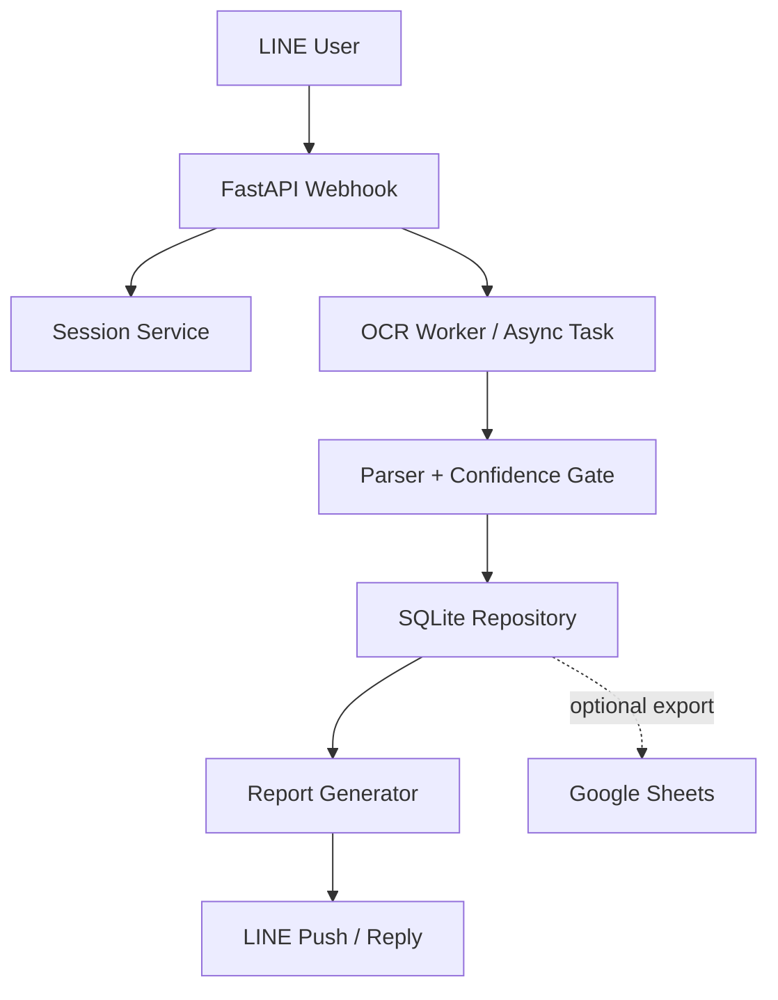

# v0.3.0 SQLite Performance Upgrade

เอกสารนี้เป็น implementation direction สำหรับ `v0.3.0`: ย้าย critical data path จาก Google Sheets-first ไปเป็น SQLite-first เพื่อให้ระบบตอบสนองเร็วขึ้นและเสถียรขึ้นสำหรับการใช้งานคนเดียวหรือกลุ่มเล็ก

ขอบเขตรอบนี้คือ SQLite-first storage foundation: runtime ยังใช้ repository function เดิม แต่ค่า default ของ storage backend เปลี่ยนเป็น SQLite ผ่าน `STORAGE_BACKEND=sqlite`

## Decision

ใช้ SQLite เป็น primary operational storage สำหรับข้อมูลที่ bot ต้องอ่าน/เขียนระหว่าง flow หลัก:

- `meters`
- `settings`
- `batches`
- `readings`
- `pending_confirmations`
- `audit_log`

Google Sheets จะถูกลดบทบาทเป็น optional export/sync target แทนการเป็น critical path ตอนผู้ใช้ส่งรูป, ยืนยัน OCR, หรือขอดูสถานะ

หากต้องกลับไปใช้ Google Sheets ชั่วคราว ให้ตั้งค่า:

```env
STORAGE_BACKEND=sheets
```

หากต้อง mirror ข้อมูลกลับไป Google Sheets สำหรับ business visibility ให้เปิด:

```env
SHEETS_SYNC_ENABLED=true
SHEETS_SYNC_INTERVAL_SECONDS=600
SHEETS_STARTUP_PULL_ENABLED=true
SHEETS_SYNC_BATCH_SIZE=50
```

## Why SQLite

ระบบนี้มีผู้ใช้หลักเพียงคนเดียว จึงยังไม่จำเป็นต้องใช้ database server แยกอย่าง Postgres หรือ Redis ตั้งแต่ต้น SQLite ให้ latency ต่ำกว่า Google Sheets มาก เพราะอ่าน/เขียนในเครื่องเดียวกับ backend และไม่ต้องรอ network round trip ทุกครั้ง

SQLite ยังเหมาะกับรูปแบบข้อมูลของระบบตอนนี้: row-based, ปริมาณไม่ใหญ่, query ตาม `meter_id`, `batch_id`, `line_source_id`, และ timestamp เป็นหลัก

## Current Bottlenecks

จาก graphify report และการอ่าน flow ปัจจุบัน จุดที่ช้าที่สุดมีแนวโน้มเป็น external I/O ไม่ใช่ CPU:

- Google Sheets repository เรียก `get_all_records()` แล้ว filter ใน Python หลายจุด
- confirmation flow ต้องอ่าน latest reading, settings, meter metadata, batch, pending confirmation และเขียนกลับหลาย tab
- report generation อ่าน batch/readings แล้ว lookup meter metadata ทีละรายการ
- OCR และ LINE API ยังเป็น network I/O ที่ต้องคงไว้ แต่ไม่ควรถูกซ้ำเติมด้วย Sheets I/O ทุกขั้น

## Target Architecture



## Storage Responsibilities

SQLite should own:

- active meter metadata used during collection
- runtime settings such as default rate and expected meter count
- pending confirmation state that must survive process restart
- weekly batches and confirmed readings
- audit events and failure logs

Google Sheets may keep:

- human-readable backup/export
- manually shared historical data
- one-way reports generated after the critical flow finishes

## Suggested Schema

Initial tables should mirror the existing Sheets tabs closely to reduce migration risk:

| Table | Purpose | Key indexes |
| --- | --- | --- |
| `meters` | meter master data and active status | `meter_id`, `active` |
| `settings` | key/value runtime settings | `key` |
| `batches` | weekly collection batches | `batch_id`, `line_source_id`, `week`, `status` |
| `readings` | confirmed meter readings | `batch_id`, `meter_id`, `created_at`, `(meter_id, created_at)` |
| `pending_confirmations` | OCR/manual values awaiting confirm | `line_source_id`, `status`, `created_at`, `confirmation_id` |
| `audit_log` | operational events | `event_type`, `created_at`, `line_source_id` |

Use text columns for IDs and ISO timestamps. Use decimal values as text initially to avoid precision drift and keep behavior aligned with the current `Decimal` usage.

## Runtime Settings

Recommended SQLite connection settings:

```sql
PRAGMA journal_mode = WAL;
PRAGMA busy_timeout = 5000;
PRAGMA foreign_keys = ON;
```

`WAL` helps one writer and multiple readers coexist better. `busy_timeout` avoids transient "database is locked" failures when OCR/background tasks and webhook handling overlap.

Default database path:

```env
SQLITE_DB_PATH=data/solar-meter-bot.db
```

ใน Docker deployment ควร mount `data/` เป็น volume เพื่อให้ database อยู่รอดหลัง restart

## Google Sheets Sync

Auto sync ใช้ Google Sheets เป็น business mirror โดยไม่ให้ Sheets อยู่ใน critical path:

- startup pull: `meters` และ `settings` จาก Google Sheets เข้า SQLite โดยให้ Sheets ชนะ
- periodic push: `readings`, `batches`, `pending_confirmations`, `settings`, `audit_log` จาก SQLite ไป Google Sheets
- failed push ไม่ทำให้ webhook fail และจะ retry ใน sync รอบถัดไป
- `settings` ที่ค้างอยู่ใน outbox จะถูกล้างหลัง startup pull เพื่อรักษา policy ว่า Sheets ชนะตอนเริ่มระบบ

ตรวจสถานะ sync ได้ที่:

```text
GET /api/storage/sync/health
```

## Repository Migration Plan

1. Introduce a storage boundary that matches current repository functions.
2. Add SQLite implementation behind that boundary.
3. Keep existing Google Sheets repository available as legacy/export path.
4. Add a one-time migration/import command from Google Sheets to SQLite.
5. Switch read/write critical path to SQLite.
6. Add optional export from SQLite to Google Sheets after confirmation/report completion.

Avoid changing LINE webhook behavior in the same step as the storage migration. The first goal is storage parity, not UX changes.

Migration command:

```bash
rtk uv run python -m app.storage.migrate_sheets_to_sqlite
```

## Rollout Steps

1. Create SQLite schema and migration runner.
2. Seed `meters` and `settings` from the current Google Sheets data.
3. Port read APIs first: `get_active_meters`, `get_meter_by_id`, `get_settings`, `get_batch_by_id`, `get_latest_reading`.
4. Port write APIs: `append_pending_confirmation`, `append_reading`, batch updates, audit log.
5. Run the existing test suite against SQLite-backed repositories.
6. Add a manual backup/export command before using in real weekly collection.
7. Enable SQLite in production with a feature flag or explicit env setting.

## Success Criteria

`v0.3.0` is ready when:

- user can complete the normal 8-meter weekly collection flow with SQLite as the source of truth
- confirmation and status commands no longer require Google Sheets reads in the hot path
- Google Sheets outage or quota error does not block saving a confirmed reading locally
- report generation reads from SQLite and produces the same visible report data as before
- data can be exported or backed up after collection
- tests cover repository parity for batch, reading, pending confirmation, settings, and meter lookup behavior

## Non-Goals

- Multi-user concurrent production scaling
- Replacing OCR provider
- Rewriting LINE card UX
- Full bidirectional Google Sheets sync
- Introducing Postgres, Redis, or a separate queue service

Those may still be useful later, but they are not necessary for the single-user performance goal of `v0.3.0`.

## Risks

- Existing data in Google Sheets must be migrated carefully before switching source of truth.
- Local SQLite file must be backed up because it becomes operationally important.
- Multiple app instances cannot safely share one local SQLite file unless deployment is designed for it.
- Background tasks still run in-process, so long OCR jobs can still affect a single small server even after Sheets is removed from the hot path.

## Open Questions

- Should SQLite be enabled by default in development first, then production?
- Should Google Sheets export run after every confirmed reading or only after a batch completes?
- Where should the SQLite file live in Docker deployment: mounted volume, host path, or managed backup directory?
- Should pending confirmation storage move fully to SQLite in `v0.3.0`, or remain in session memory with SQLite fallback?

## Suggested Verification

Run the current test suite before and after switching storage:

```bash
rtk make test
```

Add focused repository tests for:

- latest reading by meter
- duplicate reading detection in a batch
- batch progress count and missing meters
- pending confirmation status transitions
- settings fallback values
- report data parity against known fixture rows
